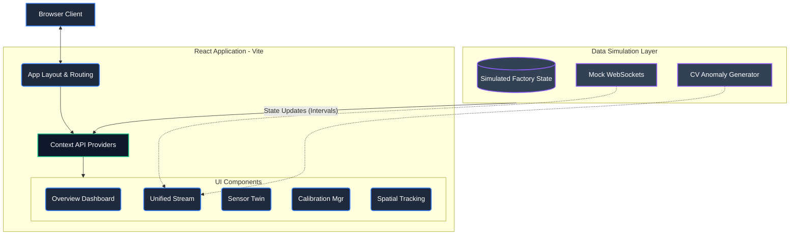

# Architecture

Cane-Pro uses a modern, lightweight, and scalable single-page application (SPA) architecture designed for extreme interactivity and high-speed data rendering.

## High-Level System Design



## Technology Stack
- **Library:** React 18
- **TypeScript:** Strict typing for better code confidence and robust architecture.
- **Bundler:** Vite
- **Visualizations:** Recharts for optimized, reactive SVG/Canvas charting.
- **Icons:** Lucide-react for consistent, clean vector iconography.

## Folder Structure

```
src/
├── assets/         # Static assets like images or static fonts
├── components/     # React functional components
│   ├── Sidebar.tsx
│   ├── TopNav.tsx
│   ├── Overview.tsx
│   ├── UnifiedStream.tsx
│   ├── SensorTwin.tsx
│   ├── CalibrationManager.tsx
│   └── SpatialTracking.tsx
├── context/        # React Context API for Global State hooks and simulation data
├── utils/          # General helper functions, formatting, and mathematical models
├── App.tsx         # Root container and Layout manager
├── index.css       # Global design variables (colors, mixins, glassmorphism)
└── main.tsx        # React DOM entry point
```

## State Management & Simulation Layer
Cane-Pro bypasses heavyweight solutions like Redux in favor of the **React Context API** coupled with custom Hooks. This allows discrete data (like calibration state vs stream state) to be securely managed and optionally grouped without massive boilerplate.

Currently, the application relies heavily on a **Data Simulation Layer** injected into the generic Context. This layer utilizes `setInterval` algorithms and seeded math models (inside `/utils`) to replicate active real-world scenarios. In a production build, this simulation layer is natively designed to be rapidly detached and swapped for real remote procedures (e.g., standard HTTP fetches, GraphQL subscriptions, or WebSockets).

## Layout Routing
Currently, the application handles view transitioning locally inside `App.tsx` (`renderContent()`) utilizing local state (`activeTab`). For future scalability, this lightweight layout engine can be seamlessly migrated to a routing library like `react-router-dom` when distinct URL paths become structurally necessary.

## Design System
- Built on foundational Vanilla CSS (`index.css`).
- Relies heavily on **CSS Variables (Custom Properties)** for easily tunable dark-mode palettes.
- Implementation of `backdrop-filter` for deep glassmorphism aesthetics.
- Charts maintain a unified coordinate and styling matrix that hooks directly into the root theme variables to ensure seamless blended UI.
